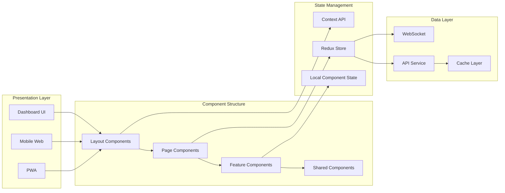
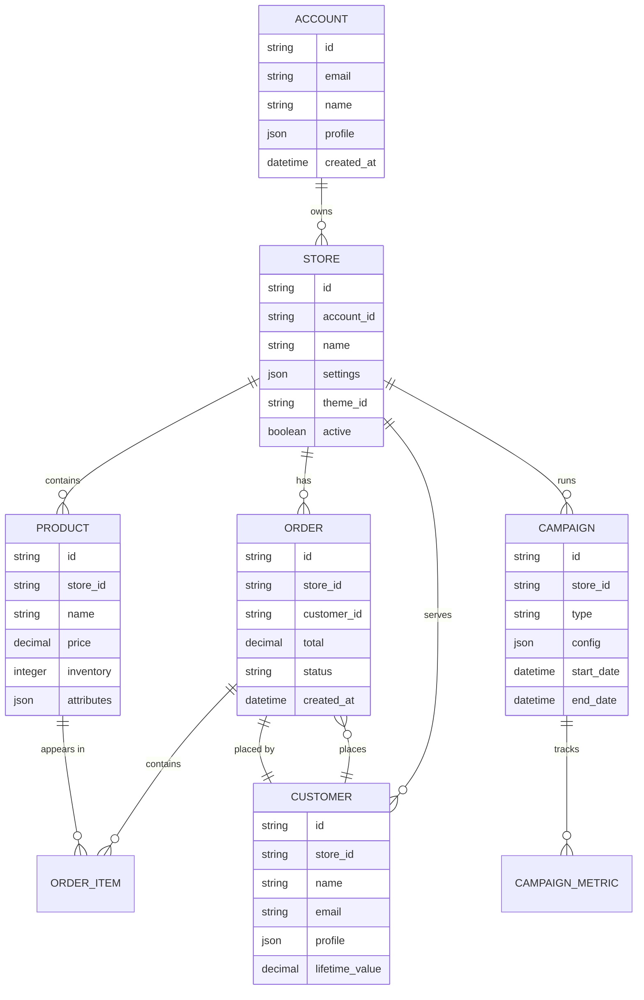
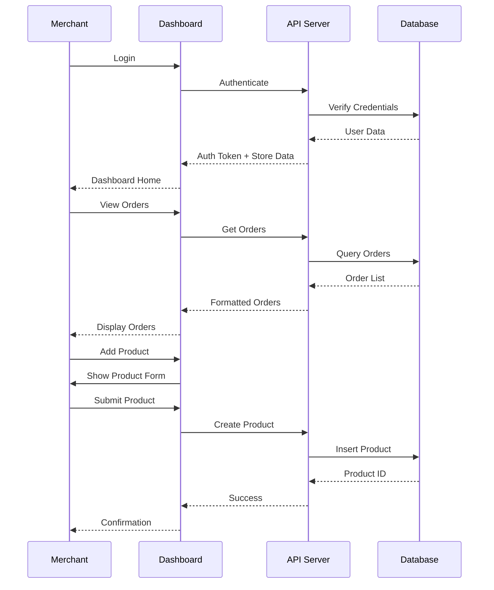
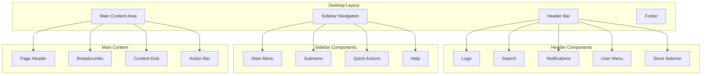
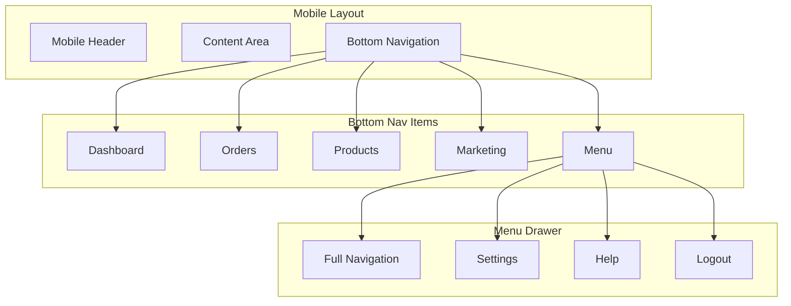

# Ordify Dashboard Architecture Diagrams

## Navigation Flow Diagram

```mermaid
graph TB
    A[Merchant Dashboard] --> B[Overview/Home]
    A --> C[Orders Management]
    A --> D[Products & Catalog]
    A --> E[Customers]
    A --> F[Marketing Hub]
    A --> G[Analytics & Reports]
    A --> H[Store Settings]
    A --> I[Design & Content]
    A --> J[Apps & Integrations]
    A --> K[Financial Center]
    
    B --> B1[Key Metrics]
    B --> B2[Quick Actions]
    B --> B3[Activity Feed]
    B --> B4[Store Health]
    
    C --> C1[All Orders]
    C --> C2[Order Processing]
    C --> C3[Order Issues]
    C --> C4[Customer Blocks]
    C --> C5[Order Analytics]
    
    D --> D1[Product Management]
    D --> D2[Categories]
    D --> D3[Collections]
    D --> D4[Reviews & Ratings]
    D --> D5[Digital Catalog]
    
    E --> E1[Customer Database]
    E --> E2[Customer Analytics]
    E --> E3[Communication]
    E --> E4[Loyalty & Rewards]
    
    F --> F1[Campaign Management]
    F --> F2[Promotion Tools]
    F --> F3[Customer Acquisition]
    F --> F4[Retargeting]
    F --> F5[Integrations]
    F --> F6[Social Commerce]
    
    G --> G1[Sales Analytics]
    G --> G2[Customer Analytics]
    G --> G3[Marketing Analytics]
    G --> G4[Custom Reports]
    
    H --> H1[Store Information]
    H --> H2[Shipping & Delivery]
    H --> H3[Payment Methods]
    H --> H4[Store Policies]
    H --> H5[Staff & Permissions]
    
    I --> I1[Theme Management]
    I --> I2[Content Pages]
    I --> I3[Media Library]
    I --> I4[SEO & Metadata]
    
    J --> J1[Installed Apps]
    J --> J2[App Marketplace]
    J --> J3[API Access]
    
    K --> K1[Wallet]
    K --> K2[Transactions]
    K --> K3[Billing]
    K --> K4[Payouts]
```



## Component Architecture



## Data Model Structure (Single Store - Scalable)



## User Flow for Key Actions



## Dashboard Layout Structure



## Mobile Navigation Architecture



## Implementation Phases Timeline

```mermaid
gantt
    title Ordify Dashboard Implementation Plan
    dateFormat  YYYY-MM-DD
    section Phase 1
    Navigation Structure     :2024-01-01, 7d
    Layout Components       :7d
    Core Pages             :14d
    
    section Phase 2
    Advanced Filters        :21d, 7d
    Bulk Operations        :7d
    Dashboard Customization :7d
    
    section Phase 3
    Analytics Dashboard     :35d, 14d
    AI Insights            :7d
    Predictive Features    :7d
    
    section Phase 4
    Multi-Store UI         :49d, 7d
    Store Switching        :7d
    Consolidated Reports   :7d